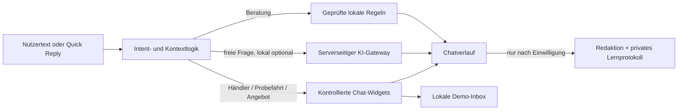

# CAIDA – Mitsubishi Conversational Commerce Prototype

[Vercel-Demo mit Gemini öffnen](https://chatbot-caida.vercel.app/) · [GitHub-Pages-Fallback öffnen](https://dgruenewald97-arch.github.io/ChatbotCAIDA/)

CAIDA ist ein Mobile-First-Konzept für eine Mitsubishi Modellberatung, die vollständig im Chat stattfindet. Der Assistent berät, merkt sich relevanten Kontext und wechselt bei transaktionalen Absichten in kontrollierte Widgets für Händlersuche, Probefahrt und Angebotsvorbereitung.

> **Concept Prototype:** Dieses Repository ist keine offizielle Mitsubishi-Anwendung. Preise und Modelldaten sind ein redaktioneller Snapshot vom 25.08.2026. Die Demo sendet keine Anfrage an Mitsubishi oder Händler.

## Was man ausprobieren kann

- freie Texteingabe mit toleranter Erkennung typischer Tippfehler;
- begründete Modellberatung statt eines starren Fragebogens;
- Vergleich von ASX, GRANDIS, ECLIPSE CROSS und OUTLANDER;
- verifizierte Händlerkarten für den Demo-Datensatz der PLZ `61169`;
- Probefahrt: Region → Partner → Wunschzeit → Kontakt → Prüfung;
- Angebotsprofil: Modell → Kauf/Finanzierung/Leasing → Priorität → Partner → Prüfung;
- lokale Demo-Inbox ohne externe Übermittlung;
- Spracheingabe, sofern der Browser sie unterstützt und der Nutzer zustimmt.
- optionales, einwilligungsbasiertes Lernprotokoll mit serverseitiger Redaktion und 30-Tage-Löschung.

## Zwei bewusst getrennte Betriebsarten

| Modus | Geeignet für | KI | Datenübertragung |
| --- | --- | --- | --- |
| GitHub Pages | Teilen, Präsentieren, mobile Tests | lokale Regel- und Widgetlogik | Formulardaten bleiben im Browserzustand |
| Vercel | Öffentliche Chef-Demo mit freien Fragen | serverseitige Gemini Interactions API mit Flash-Lite | Fragen an Gemini; Lernprotokoll nur nach separater Zustimmung |
| Lokaler Node-Server | Entwicklung und Gemini-Demo | optionaler serverseitiger Gemini-/OpenAI-Gateway | nur nach sichtbarer Aktivierung zum gewählten KI-Anbieter |

Auf GitHub Pages wird absichtlich **kein API-Key im Frontend** abgefragt. Die Vercel-Version verwendet dafür Functions und ein serverseitiges `GEMINI_API_KEY`-Secret. Details stehen in [docs/DEPLOYMENT.md](docs/DEPLOYMENT.md).

## Lokal starten

Voraussetzung: Node.js 22.

```bash
npm start
```

Dann `http://127.0.0.1:4177` öffnen. Unter Windows kann alternativ `START-CAIDA.bat` doppelt angeklickt werden.

Gemini lässt sich anschließend über den Status in der Chat-Kopfzeile verbinden. Der Key bleibt nur im Arbeitsspeicher des lokalen Servers und ist nach einem Neustart gelöscht.

## Architektur in einem Blick



Die transaktionalen Wege laufen immer vor der freien KI. Dadurch kann ein Modell weder Händler erfinden noch behaupten, eine Probefahrt sei gebucht worden.

## Projektstruktur

```text
.
├── index.html                  UI-Shell und semantisches Markup
├── styles.css                 Mobile-First Layout, Widgets und Motion
├── app.js                     Dialogzustand, Intent-Routing und UI-Flows
├── server.js                  Statischer Server und optionaler KI-Gateway
├── api/                       Vercel Functions für Status, Chat und Demo-Flow
├── lib/                       Gemeinsame KI- und HTTP-Sicherheitslogik
├── vercel.json                Functions- und Security-Header-Konfiguration
├── assets/                    Fahrzeug-, Marken- und Bot-Assets
├── docs/
│   ├── ARCHITECTURE.md        Zustände, Routing und technische Grenzen
│   ├── CONVERSATION-DESIGN.md Sprache, Flow-Verträge und UX-Regeln
│   ├── FINETUNING.md          Konkreter Leitfaden zum Weiterentwickeln
│   ├── TRAINING-DATA.md       Einwilligung, Schema, Export und Löschung
│   ├── DATA-GOVERNANCE.md     Faktenbasis und Aktualisierung
│   └── DEPLOYMENT.md          Pages, lokal und Vercel-Backend
├── QUELLEN.md                 Aktuelle Datenquellen
└── .github/workflows/pages.yml
```

## Weiterentwickeln

Der schnellste Einstieg ist [docs/FINETUNING.md](docs/FINETUNING.md). Dort steht, an welchen Stellen Intents, Daten, Gesprächston, Widgets und QA erweitert werden.

Einwilligungsbasiert gespeicherte Gespräche lassen sich für die Auswertung mit `npm run training:export` als lokales JSONL exportieren. Einrichtung, Datenschutzgrenzen und Datenschema stehen in [docs/TRAINING-DATA.md](docs/TRAINING-DATA.md).

Vor einem Commit:

```bash
npm run check
```

Danach die relevanten Dialoge sowohl auf Desktop als auch bei ungefähr `390 × 844` testen.

## Noch nicht produktiv

- keine Live-Bestände oder echten Terminslots;
- keine Händler-/CRM-API; das Lernprotokoll hat eine Demo-Einwilligung, aber noch keinen produktiven CMP-/Rechtsprozess;
- kein persistentes Nutzerprofil;
- nur ein verifizierter Händler-Demo-Datensatz;
- der Vercel-Rate-Limiter ist für eine begrenzte Demo ausgelegt, nicht für eine öffentliche Kampagne;
- Modell-, Preis- und Verbrauchsdaten müssen regelmäßig aktualisiert werden.
